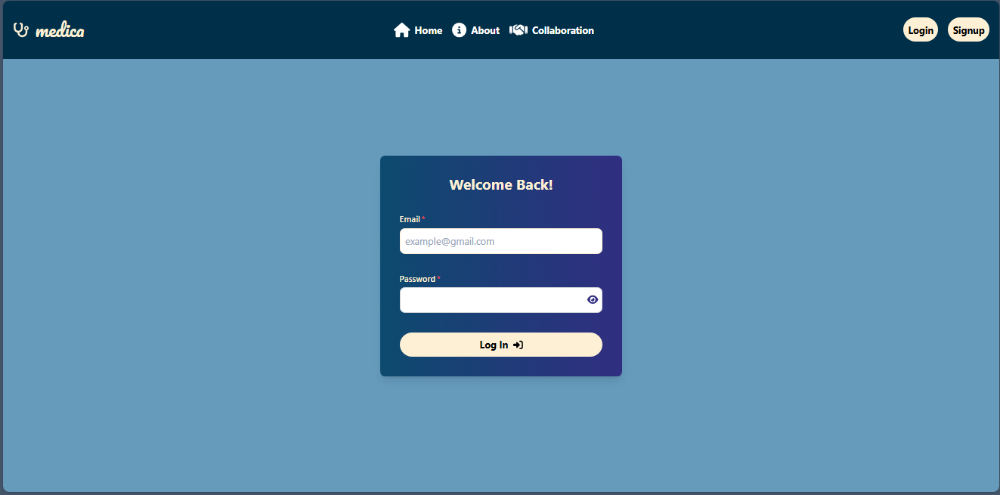
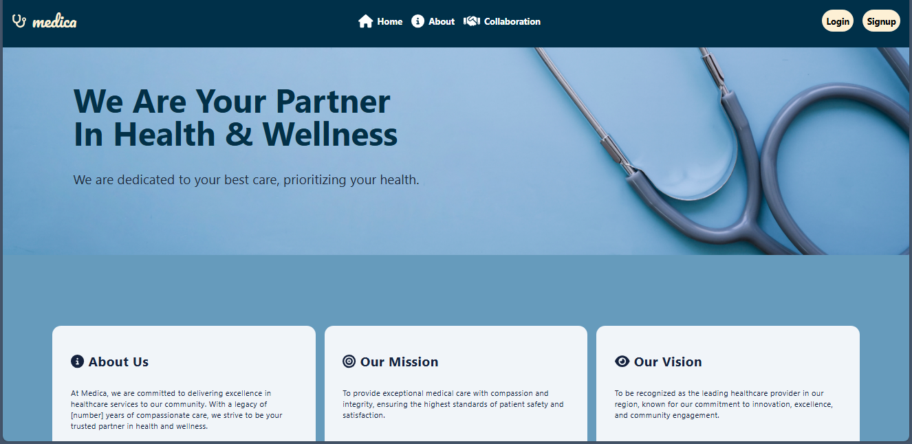

# Hospital Information System - Surgery Department 
This project aims to develop a comprehensive database system for the Surgery Department within a hospital. 
Features include: specialised user accounts (doctors, nurses, patients,..), appointment setting/ acceptance, doctor-patient communication line for appointment/surgery date, additional information, or attachments (X-rays, blood works,..), and the abilty to view multiple doctors' profiles  and vice versa.

### Home page

### Login page

### About

